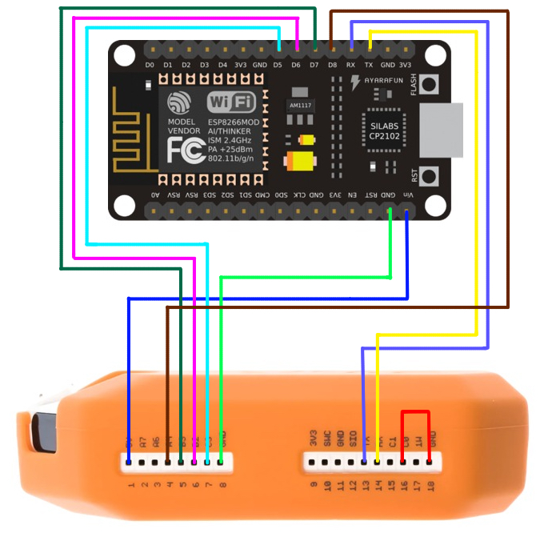

# FlipperZero X NodeMCU

This is a quick guide on how to use a NodeMCU as an ESP8266 module for FlipperZero.  
For this project i'll be using [RogueMaster](https://github.com/RogueMaster/flipperzero-firmware-wPlugins) CFW, because it already have installed the ESP8266 Deauther app by default.
 
 

## Installing the firmware on your NodeMCU

First you have to flash your NodeMCU with [SequoiaSan's](https://github.com/SequoiaSan) firmware. You can do it from [here](https://sequoiasan.github.io/FlipperZero-Wifi-ESP8266-Deauther-Module/) using Chrome.

 

## Connection diagram of FlipperZero to NodeMCU

